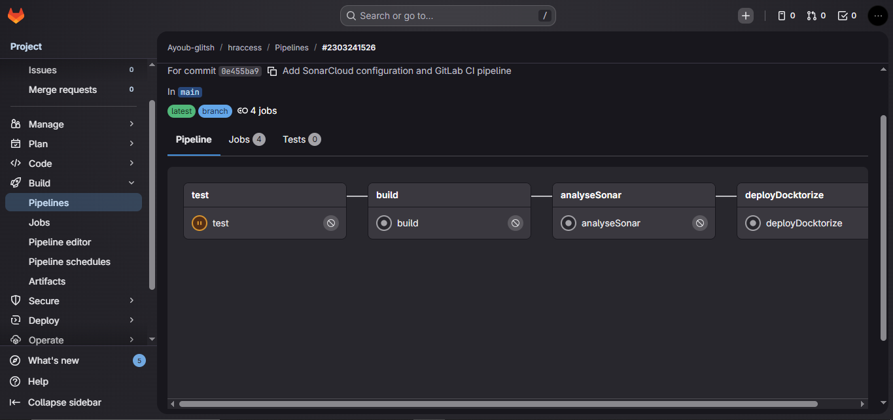
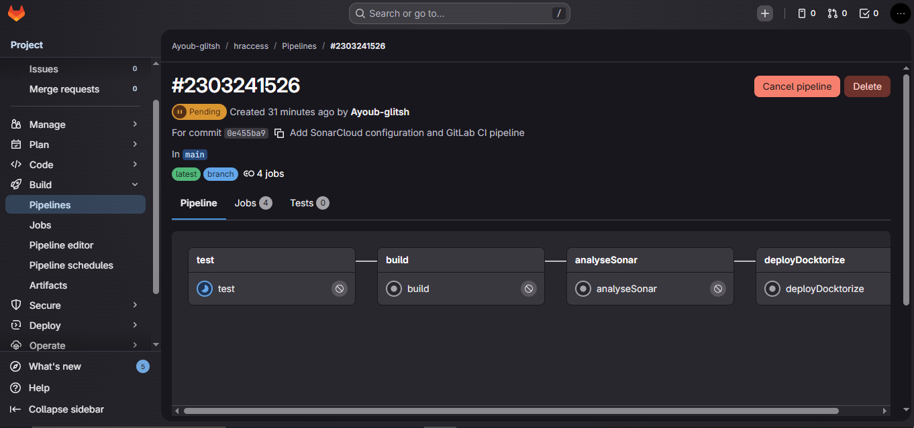
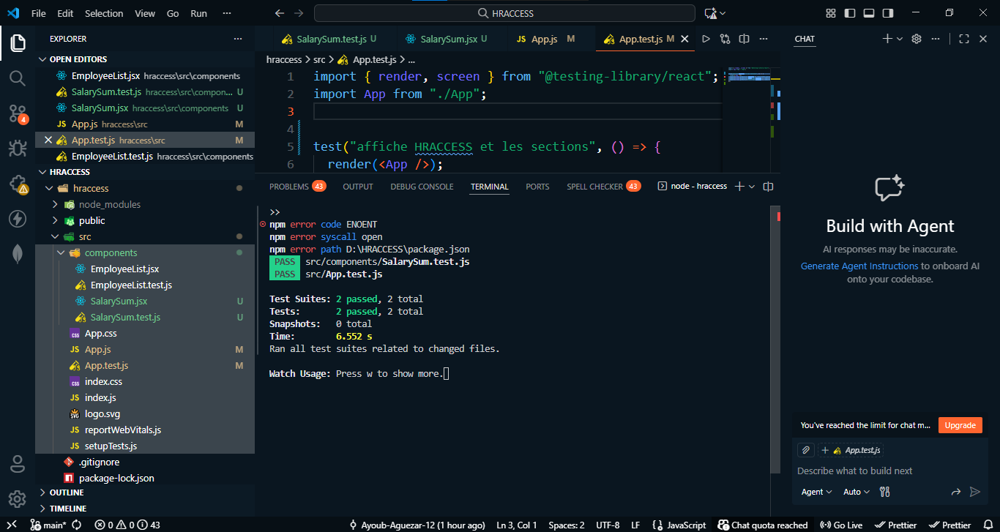

  

  
   

  
   

📘 Documentation Technique – Projet HRACCESS
============================================

1\. Présentation du projet
--------------------------

**HRACCESS** est une application web développée avec **React** permettant de gérer et visualiser une liste d’employés ainsi que le calcul automatique de la masse salariale.  
Le projet intègre une **chaîne CI/CD complète avec GitLab**, incluant les **tests unitaires**, l’**analyse de qualité du code avec SonarCloud** et la **containerisation avec Docker**.

* * *

2\. Objectifs techniques
------------------------

*   Développer une application React modulaire
    
*   Mettre en place des **tests unitaires** avec Jest
    
*   Automatiser le cycle **Build / Test / Analyse / Déploiement**
    
*   Utiliser **SonarCloud** pour l’analyse de la qualité du code
    
*   Déployer l’application sous forme d’**image Docker**
    
*   Utiliser **GitLab CI/CD** avec un **runner dédié**
    

* * *

3\. Architecture du projet
--------------------------

    hraccess/
    ├── src/
    │   ├── components/
    │   │   ├── EmployeeList.jsx
    │   │   ├── EmployeeList.test.js
    │   │   ├── SalarySum.jsx
    │   │   └── SalarySum.test.js
    │   ├── App.js
    │   ├── App.test.js
    │   └── index.js
    ├── public/
    ├── Dockerfile
    ├── .gitlab-ci.yml
    ├── sonar-project.properties
    ├── package.json
    └── README.md
    

* * *

4\. Technologies utilisées
--------------------------

## 🛠️ Technologies utilisées

| Technologie | Rôle |
|------------|------|
|  **React** | Interface utilisateur |
|  **JavaScript (ES6)** | Logique applicative |
|  **Jest & Testing Library** | Tests unitaires |
|  **GitLab CI/CD** | Automatisation du pipeline |
|  **SonarCloud** | Analyse de la qualité du code |
|  **Docker** | Containerisation de l’application |
|  **GitLab Runner** | Exécution des jobs CI/CD |

* * *

5\. Description des composants
------------------------------

### 5.1 EmployeeList

*   Affiche la liste des employés
    
*   Données statiques (matricule, nom, salaire)
    
*   Test unitaire vérifiant l’affichage des données
    

### 5.2 SalarySum

*   Calcule la somme totale des salaires
    
*   Reçoit les employés en props
    
*   Test unitaire vérifiant le calcul exact
    

* * *

6\. Tests unitaires
-------------------

Les tests sont exécutés avec **Jest** et **@testing-library/react**.

Commande locale :

    npm test
    

Les tests couvrent :

*   Le rendu des composants
    
*   La présence des données
    
*   La logique de calcul de la somme des salaires
    

* * *

7\. Intégration Continue – GitLab CI/CD
---------------------------------------

Le pipeline CI/CD est défini dans le fichier `.gitlab-ci.yml`.

### Étapes du pipeline :

1.  **Test** : exécution des tests unitaires
    
2.  **Build** : génération du build React
    
3.  **AnalyseSonar** : analyse de la qualité du code via SonarCloud
    
4.  **DeployDockerize** : création et publication de l’image Docker
    

Le pipeline est déclenché automatiquement à chaque `git push` sur la branche `main`.

* * *

8\. Analyse de qualité – SonarCloud
-----------------------------------

L’analyse SonarCloud est configurée via le fichier :

    sonar-project.properties
    

Critères analysés :

*   Bugs
    
*   Code Smells
    
*   Maintainability
    
*   Reliability
    
*   Security
    

Les résultats sont consultables sur le tableau de bord SonarCloud du projet.

* * *

9\. Containerisation – Docker
-----------------------------

L’application est déployée via Docker avec un serveur **Nginx**.

### Commandes Docker (local) :

    docker build -t hraccess .
    docker run -p 8080:80 hraccess
    

Accès application :

    http://localhost:8080
    

* * *

10\. Gestion des runners GitLab
-------------------------------

Le pipeline est exécuté grâce à un **GitLab Runner Windows auto-hébergé**, enregistré comme **Project Runner**, permettant l’exécution des jobs CI/CD.

* * *

11\. Sécurité
-------------

*   Les tokens sensibles (SonarCloud, Registry) sont stockés dans **GitLab CI/CD Variables**
    
*   Les tokens sont masqués et non présents dans le code source
    

* * *

12\. Conclusion
---------------

Le projet HRACCESS met en œuvre une **chaîne DevOps complète**, conforme aux bonnes pratiques industrielles, incluant :

*   Développement modulaire
    
*   Tests automatisés
    
*   Analyse de qualité du code
    
*   Déploiement containerisé
    
*   Automatisation CI/CD
    

Ce projet constitue une base solide pour des applications professionnelles évolutives.

* * *

    

